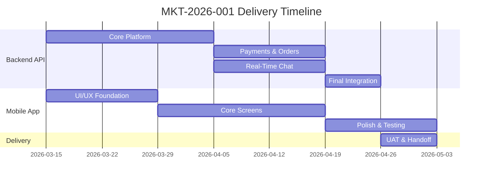

# Ahmed Almadani · Project Hub

> [!info] Quick Reference
> **Project:** KSA Furniture Marketplace Platform
> **Code:** `MKT-2026-001`
> **Status:** 🟡 Proposal / Pre-Contract
> **Payment:** 100% upon project delivery

---

## Documents

| # | Document | Purpose | Status |
|---|----------|---------|--------|
| 01 | [[01 - Invoice #MKT-2026-001]] | Itemized project invoice | Draft |
| 02 | [[02 - Development Contract]] | Binding service agreement | Draft |
| 03 | [[03 - Scope of Work]] | Full feature and API scope | Draft |

---

## Project at a Glance

![[Project Overview.canvas]]

---

## Project Pillars

- **Mobile-First**: Native iOS & Android app
- **Bilingual**: Full Arabic & English support (RTL/LTR)
- **Real-Time**: Live chat between buyers and sellers
- **Secure Payments**: Saudi-compliant payment gateway
- **Marketplace**: Individual sellers + registered stores

---

## Milestones

---

## Key Contacts

| Role | Name | Contact |
|------|------|---------|
| Client | Ahmed Almadani | — |
| Project Lead | — | — |

---

*Last updated: 2026-03-08*
